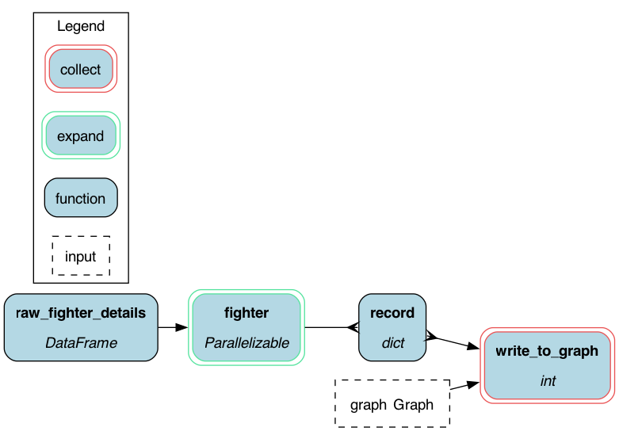
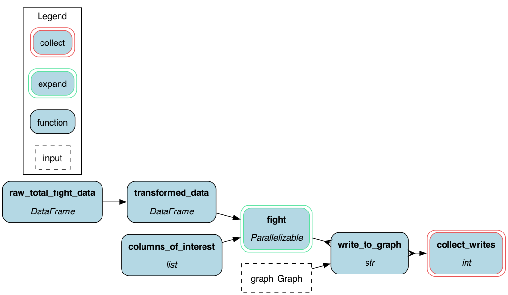
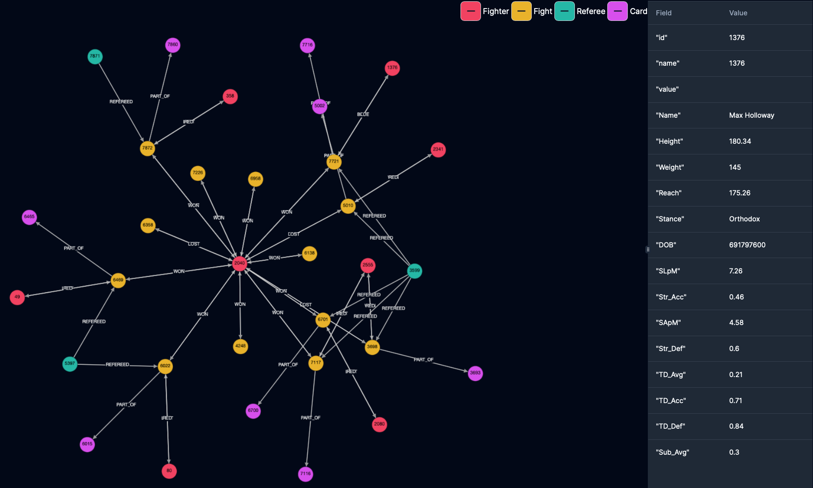
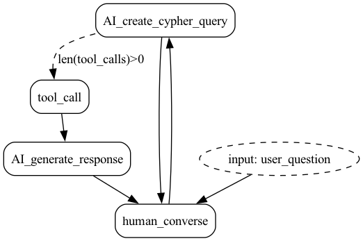
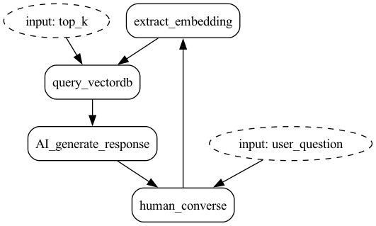

# UFC Knowledge graph demo

## Introduction
This demo illustrates two alternative to building a RAG Q&A AI agent over the [UFC stats dataset](https://www.kaggle.com/datasets/rajeevw/ufcdata)
One uses a Knowledge Graph and the other uses a Vector DB.

The point of this example is to show you where a Knowledge Graph might be more appropriate than a Vector DB; vector
DBs are all the rage, but they're not always the best tool for the job.

## Data
The [UFC](http://ufc.com) publicly offers statistics for each fight it held in addition to individual figher's
personal statistics on [UFC stats](http://ufcstats.com/statistics/events/completed)

This information includes among other details:
* Where and when an event was held
* Details and statistics of a fight
* Who won a fight
* How long a fight lasted
* Fighter's reach

# Burr to structure our AI agents
We will use [Burr](https://github.com/dagworks-inc/burr) to structure our AI agent. Burr is an open-source Python library
that allows you to model your application as a flow chart, which is great for building AI agents. It also comes with
an open-source telemetry UI to help you debug and see the state of your application as it runs.

# Querying the AI agent
Once the data is loaded either into a Knowledge Graph or into a Vector DB, users can start asking the AI agent questions. For example:

```
Which fighter holds the fastest win?

The fighter who holds the fastest win is Jorge Masvidal, with a win in just 5 second

Who did he win against ?

Jorge Masvidal won against Ben Askren in the fight where he secured the fastest win.

List fighters who had a trilogy match

The only fighters specifically identified in the data having a trilogy (i.e., three matches against the same opponent) are:

- Frankie Edgar and BJ Penn
- Randy Couture and Vitor Belfort
- BJ Penn and Frankie Edgar
- Cain Velasquez and Junior Dos Santos
...

Who has a 50% win percentage?

Yes, there are fighters with a 50% win percentage in the dataset. Here are a few of them:

- Joe Slick: 1 win out of 2 fights (50%)
- Ken Stone: 2 wins out of 4 fights (50%)
- Tim Boetsch: 12 wins out of 24 fights (50%)
- Jordan Wright: 1 win out of 2 fights (50%)
- Travis Fulton: 1 win out of 2 fights (50%)

```

## Running the demo

Install Python modules
```sh
pip install -r requirements.txt
```

## Knowledge Graph Approach
### Prerequisites

Run FalkorDB
```sh
docker run -p 6379:6379 -p 3000:3000 -it --rm falkordb/falkordb:edge
```

Create the Knowledge Graph
From the `./UFC/graph` folder, run:

#### Ingest data using the command line:

```sh
python hamilton_ingest.py
```
This will run the following two pipelines:




#### Ingest data using a notebook:

```sh
pip install jupyter
jupyter notebook 
# select ingest_notebook.ipynb and follow the instructions there
```

### Run the QA agent via the notebook:
```sh
export OPENAI_API_KEY="YOUR_OPENAI_KEY"
pip install jupyter
jupyter notebook 
# select qa_notebook.ipynb and follow the instructions there
```

### Run the QA agent via the command line:
```sh
export OPENAI_API_KEY="YOUR_OPENAI_KEY"
python burr_QA.py
```

Knowledge Graph generated:




Application Graph generated:


## Vector DB Approach
### Prerequisites
Create vector index, in this demo we'll be using [Pinecode](https://www.pinecone.io).
The process of indexing the data can take about 15 minutes as we're creating ~10K vector embeddings and indexing them.

From the `./UFC/vector` folder, run:
```
export OPENAI_API_KEY="YOUR_OPENAI_KEY"
export PINECONE_API_KEY="YOUR_PINECONE_API_KEY"
python ingest.py
```

### Run the QA agent via the notebook:
```sh
export OPENAI_API_KEY="YOUR_OPENAI_KEY"
export PINECONE_API_KEY="YOUR_PINECONE_API_KEY"
pip install jupyter
jupyter notebook 
# select qa_notebook.ipynb and follow the instructions there
```

### Run the QA agent via the command line:
```sh
export OPENAI_API_KEY="YOUR_OPENAI_KEY"
export PINECONE_API_KEY="YOUR_PINECONE_API_KEY"
python burr_QA.py
```

Application Graph generated:


# Results 
From running the examples you'll see that the knowledge graph version managed to generate much more accurate answers
using FEWER tokens. This can be attributed to a number of reasons:

1. Because Knowledge graph follows a certain schema, the LLM has a good understanding of the available data, 
unlike vector embeddings where the concept of a schema doesn't exist.

2. The LLM has access to the entire knowledge base via a well-established query language (Cypher).
With a Vector DB, the model is limited to K (in our case 20) documents which are semantically similar to the user's question.

3. In cases where the user question isn't semantically similar to a possible answer,
the chances for the model to generate a decent answer are slim.
Allowing the LLM to generate a query for each user question increases the chances for the model to get the 
relevant data for a given question.

4. Questions requiring access to large portion of the data (e.g., how many fights were held by the UFC?
or Which fighter has most wins?) can't be answered using the Vector DB approach as it is limited to a set of documents
similar to the user question. On the other hand, when using a Knowledge Graph, the LLM is able to compose a query which will
perform the necessary aggregations, and it is able to use the query result to compose its final answer.

# Conclusion
This was a slightly contrived example to highlight the difference between what a Knowledge Graph DB can do versus what a Vector DB can do.
